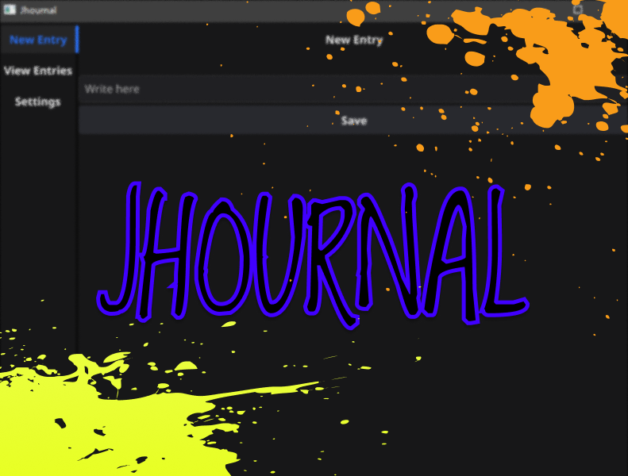
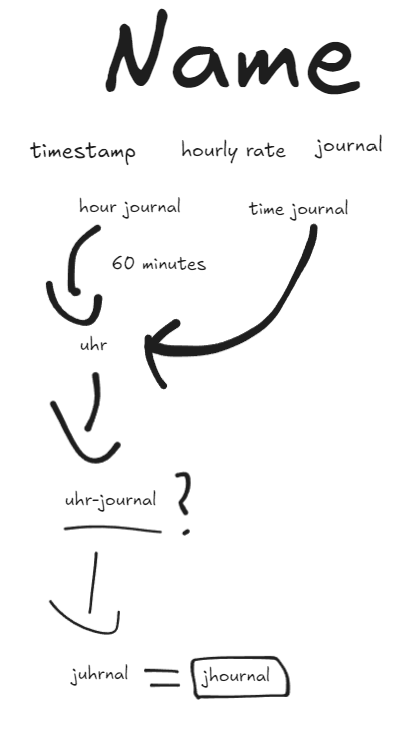

    <!--67 haha-->

   The hourly journal.
    
    
   
   
   
     
   
   

**Jhournal** is a kind of journal that only lets you write a short (77 character) entry every hour.
It is written entirely in [Go](https://go.dev/) with [Fyne](https://fyne.io/), a cross-platform GUI toolkit.

## Features
> Note: This project is still a ***WIP***, so you might come across some errors. In such case please [create an issue](https://github.com/sharkmu/jhournal/issues/new) about it

There are 3 tabs on the left side of the window.
1. **New entry** - Create a new journal entry.
2. **View entries** - Browse and read your previous entries.
3. **Settings** - Change your configurations.

## Contribution
Feel free to contribute to the project. Be aware that this is a beginner project, so the code may sometimes be slightly harder to read. You can also collaborate by making an issue or giving feedback. Or even just by editing this README.md and making a PR.

## Installation
### Manually
- Clone the repository with [git](https://git-scm.com/): `git clone https://github.com/sharkmu/jhournal.git`
- Make sure that you have [Go](https://go.dev/) installed
- Go to the repository's folder: `cd jhournal`
- Install the necessary packages: `go mod tidy`
- To run the repository: `go run .`
- To build the repository: `go build`, if this doesn't work on Windows, then instead try running: `go build -ldflags="-s -w -H=windowsgui" -o jhournal.exe .`

### Download from [Releases](https://github.com/sharkmu/jhournal/releases)
You can download the binary file for Jhournal from the latest release in the [Releases](https://github.com/sharkmu/jhournal/releases) tab

## About the name
Below you can see an [Excalidraw](https://excalidraw.com/) that I made, when I was trying to name the project:

   

